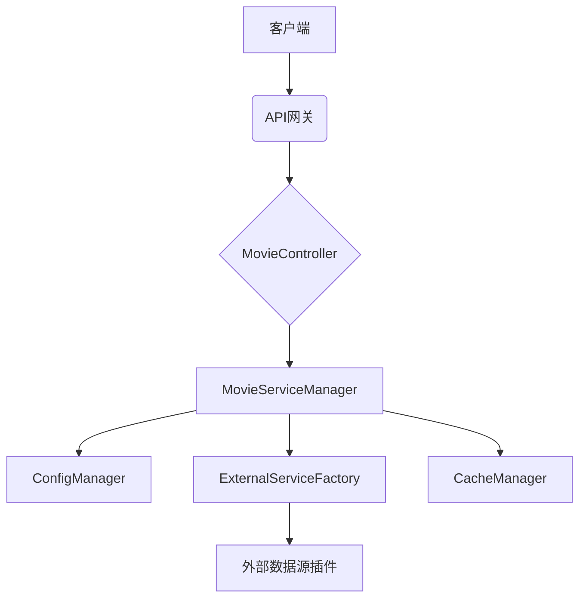

# 电影数据获取服务

这是一个可扩展的电影数据获取服务，支持通过外部JAR插件扩展数据源。该服务提供统一的RESTful API接口，能够从多个不同的电影网站获取电影信息、剧集列表和播放地址。

## 目录

- [功能特性](#功能特性)
- [系统架构](#系统架构)
- [快速开始](#快速开始)
  - [环境要求](#环境要求)
  - [构建项目](#构建项目)
  - [运行应用](#运行应用)
- [API接口说明](#api接口说明)
- [配置说明](#配置说明)
  - [数据源配置](#数据源配置)
  - [URL映射配置](#url映射配置)
- [扩展开发](#扩展开发)
  - [创建自定义数据源](#创建自定义数据源)
  - [现有数据源插件](#现有数据源插件)
- [常见问题](#常见问题)

## 功能特性

- **统一API接口**: 提供RESTful API接口，统一访问不同数据源的电影数据
- **插件化架构**: 支持通过外部JAR插件扩展数据源，易于添加新的电影网站支持
- **并发处理**: 支持并发从多个数据源获取数据，提高查询效率
- **缓存机制**: 内置缓存功能，减少重复请求，提高响应速度
- **灵活配置**: 通过XML配置文件管理数据源和URL映射关系

## 系统架构



## 快速开始

### 环境要求

- Java 17 或更高版本
- Maven 3.6 或更高版本

### 构建项目

使用Maven Wrapper构建整个项目：

```bash
./mvnw clean package
```

执行该命令将在 `target` 目录下生成以下内容：
- `get_movie_data-0.0.1-SNAPSHOT.jar` - 主程序jar文件
- `config/` - 配置文件目录
- `libs/` - 外部数据源插件目录

### 运行应用

```bash
java -jar target/get_movie_data-0.0.1-SNAPSHOT.jar
```

应用启动后，默认在8080端口提供HTTP服务。

## API接口说明

### 搜索电影

```
GET /api/movie/search/all?keyword={关键词}
```

并发从所有配置的数据源搜索电影，返回电影列表。

### 获取剧集列表

```
GET /api/movie/episodes?baseUrl={基础URL}&playUrl={播放地址}
```

根据基础URL确定数据源，获取指定电影的所有剧集信息。

### 获取M3U8播放地址

```
GET /api/movie/m3u8?baseUrl={基础URL}&episodeUrl={剧集地址}
```

根据基础URL确定数据源，获取指定剧集的M3U8播放地址。

## 配置说明

配置文件位于 `config/movie-data-config.xml`，包含数据源配置和URL映射配置两部分。

### 数据源配置

在 `<datasources>` 标签下配置数据源信息：

```xml
<datasource id="数据源ID" class="完整类名">
    <name>数据源名称</name>
    <description>数据源描述</description>
</datasource>
```

### URL映射配置

在 `<urlMappings>` 标签下配置URL到数据源的映射关系：

```xml
<urlMapping baseUrl="数据源基础URL" datasource="数据源ID"/>

<!-- 通配符匹配，作为默认数据源 -->
<urlMapping baseUrl="*" datasource="默认数据源ID"/>
```

## 扩展开发

### 创建自定义数据源

1. 参考 [custom-datasource](custom-datasource/) 项目作为模板
2. 实现 [ExternalMovieService](src/main/java/org/example/get_movie_data/service/ExternalMovieService.java) 接口
3. 使用Maven打包成JAR文件
4. 将JAR文件放入 `libs/` 目录
5. 在配置文件中添加相应的数据源配置
6. 重启应用程序使配置生效

### 现有数据源插件

项目包含以下现成的数据源插件：

- [云云TV](yuny/README.md) - 从云云TV网站获取电影数据
- [BFZY](bfzy/README.md) - 从bfzy.tv网站获取电影数据
- [茶杯狐](chabeigu/README.md) - 从茶杯狐网站获取电影数据

## 常见问题

### Q: 如何修改配置文件？

A: 配置文件位于应用目录下的 `config/movie-data-config.xml`，可以直接编辑该文件并重启应用。

### Q: 如何添加自定义数据源？

A: 开发符合规范的JAR包，放到 `libs/` 目录下，并在配置文件中添加相应配置项。

### Q: 配置未生效怎么办？

A: 检查配置文件格式是否正确，确认配置文件位于正确的目录位置，然后重启应用程序。

### Q: 如何查看API文档？

A: 应用启动后，访问 `http://localhost:8080/swagger-ui.html` 查看Swagger API文档。

